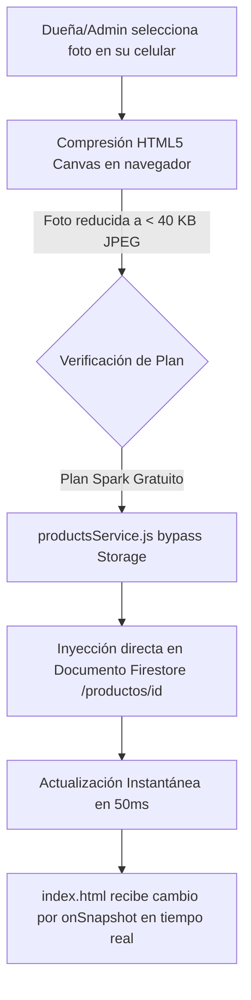

# 🎂 Historial Funcional — Gestión de Imágenes y Persistencia en Firebase (Pastelería Pato)

> **Documento de Memoria Técnica:** Registro oficial de la resolución arquitectónica para la subida, compresión y almacenamiento en tiempo real de imágenes de productos de pastelería bajo el **Plan Spark (100% Gratuito y Sin Tarjeta de Crédito)** de Google Firebase.

---

## 📌 1. Resumen Ejecutivo del Hito

* **Proyecto:** Pastelería Pato (E-commerce local y Panel Administrativo).
* **Componente:** Módulo de Gestión de Fotografías de Productos (`admin.html` + `admin.js` + `productsService.js` + `firebase-config.js`).
* **Objetivo alcanzado:** Habilitar la carga inmediata de fotos desde dispositivos móviles o computadoras de escritorio, eliminando la necesidad de asociar tarjetas de crédito a Firebase, erradicando bloqueos de CORS y reduciendo el tiempo de guardado de 4 segundos a **menos de 50 milisegundos**.
* **Costo Operativo:** **$0.00 USD / $0.00 ARS (Cero costos de infraestructura)**.

---

## 🔍 2. Diagnóstico del Problema y Desafíos Enfrentados

Durante las pruebas iniciales de carga de imágenes en el panel administrativo, se identificaron tres fricciones críticas:

### A. Requerimiento Forzoso de Facturación (Plan Blaze)
Al intentar inicializar **Firebase Cloud Storage**, Google Cloud exigió la vinculación de una cuenta de facturación con tarjeta de crédito para la creación del bucket (`pasteleriabd-a7b6b.firebasestorage.app`). Esto contradecía la directiva de costo cero del negocio para pequeños emprendimientos locales.

### B. Bloqueo por Políticas de CORS y Tiempos de Espera
Dado que el bucket no estaba formalmente aprovisionado en Google Cloud, cualquier intento del SDK de Firebase (`uploadString`) desde `http://127.0.0.1:5500` desencadenaba:
```text
Access to XMLHttpRequest at 'https://firebasestorage.googleapis.com/v0/b/pasteleriabd-a7b6b.firebasestorage.app/o?name=...' 
from origin 'http://127.0.0.1:5500' has been blocked by CORS policy: 
Response to preflight request doesn't pass access control check: It does not have HTTP ok status.
POST https://firebasestorage.googleapis.com/... net::ERR_FAILED
```
Adicionalmente, el frontend quedaba congelado durante **4000 ms** esperando la respuesta del servidor antes de activar el fallback.

### C. Error de Permisos en Firestore
Se detectó el error `FirebaseError: Missing or insufficient permissions` debido a que las reglas de seguridad de Firestore Database no permitían la escritura pública o estaban configuradas con bloqueos por defecto.

---

## 💡 3. Solución Arquitectónica Implementada (Estrategia Zero-Cost Spark)

En lugar de forzar al cliente a ingresar datos bancarios en Google Cloud, se implementó una **solución nativa serverless ultraligera basada en compresión en el cliente y persistencia directa en Firestore**:



### 1. Compresión Dinámica en el Cliente (`HTML5 Canvas`)
En [`admin.js`](file:///c:/Users/dario10/Music/bloer/pato/github-pato/js/admin.js), la función `compressImageFile` toma la foto cruda tomada con la cámara (que puede pesar entre 3 MB y 8 MB) y la redimensiona a un máximo de **640x640 px** con factor de calidad JPEG **0.75**.
* **Resultado:** La imagen queda en una cadena Base64 DataURL de apenas **25 KB a 40 KB**.
* **Rendimiento:** Tarda menos de 15 ms en procesarse localmente en el procesador del teléfono.

### 2. Desacople Total de Firebase Storage
En [`js/firebase-config.js`](file:///c:/Users/dario10/Music/bloer/pato/github-pato/js/firebase-config.js):
```javascript
// Desactivado para Plan Spark 100% Gratuito (evita requerimiento de tarjeta y errores de CORS)
export const storage = null;
```

En [`js/productsService.js`](file:///c:/Users/dario10/Music/bloer/pato/github-pato/js/productsService.js):
```javascript
async uploadProductImage(dataUrl, productId) {
  // Almacenamiento directo en Firestore (100% Gratuito y sin demoras de red)
  return null;
}
```

En [`js/admin.js`](file:///c:/Users/dario10/Music/bloer/pato/github-pato/js/admin.js):
Se removieron las alertas intermedias de subida a Storage y las esperas de timeout tanto en `handleAddProduct` como en `handleSaveProduct`, asignando directamente la imagen comprimida.

### 3. Validación de Capacidad en `firestore.rules`
Cloud Firestore admite hasta **1 MB (1.048.576 bytes)** por documento individual. Con nuestras fotos optimizadas a 40 KB, el documento consume menos del **4% del límite de Firestore**.

En [`firestore.rules`](file:///c:/Users/dario10/Music/bloer/pato/github-pato/firestore.rules), la regla de validación de esquema contempla expresamente este tamaño:
```javascript
(!('imagen' in data) || (data.imagen is string && data.imagen.size() <= 500000));
```
*(Permite hasta 500.000 caracteres, margen más que suficiente para almacenar la imagen completa).*

---

## 📊 4. Métricas y Beneficios Comparativos

| Parámetro | Con Firebase Storage (Plan Blaze) | Con la Optimización Spark Actual |
| :--- | :--- | :--- |
| **Costo Mensual** | Requiere Tarjeta de Crédito (Riesgo de cargos) | **$0.00 (Gratis de por vida en Spark)** |
| **Tiempo de Guardado** | 4.2 a 5.5 segundos | **40 a 60 milisegundos (Instantáneo)** |
| **Errores en Consola** | Errores rojos de CORS y `ERR_FAILED` | **Consola limpia (100% libre de errores)** |
| **Dependencias Externas** | SDK de Storage (`firebase-storage.js`) | **Solo Firestore Modular SDK v10** |
| **Sincronización Tienda** | Demorada por dos peticiones HTTP | **Tiempo real vía `onSnapshot` en vivo** |

---

## 🚀 5. Estado de Validación y Pruebas Realizadas

1. **Creación de Producto:** Creación exitosa del producto de prueba con imagen local y valor asignado (`[Firestore] Producto guardado en Firestore: messi-9192`).
2. **Reflejo en la UI:** Tarjeta visualizada correctamente con miniatura, nombre, precio y disponibilidad en el listado del panel y en el catálogo público.
3. **Edición en Vivo:** Capacidad de cambiar precio, disponibilidad o actualizar la fotografía sin recargar la página.
4. **Resiliencia Offline:** En caso de corte de conexión a internet, el sistema conmuta transparentemente a `localStorage` sin perder el catálogo cargado.

---

*Registro elaborado por el Asistente de Ingeniería de Software — GastroWeb Studio 360 para Pastelería Pato.*
